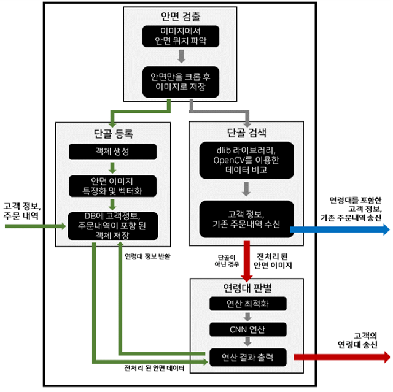

## 안면인식 기반 반응형 키오스크

사람의 얼굴 나이를 판단해 연령대에 맞는 화면을 제공하는 키오스크

| :back: Program | :globe_with_meridians: Age-Detection | :package: Face-Recognition |
|------|---|---|
| |  | |

 

## :eyes: Structure

| 시스템구성도 | 데이터처리부 | 키오스크부 |
|---|---|---|
|  |  |  |

 

## 주요 기능

| 노년층을 위한 화면 제공 | 연령별 추천 메뉴 |
|---|---|
|  |  |

 

| 얼굴인식 기반 단골등록 및 인식 |
|---|
|  |

 

## 시연 영상

| BackOffice와 연동 | 연령대 판별 및 주문 |
|------|------|
|  |  |
|  |  |